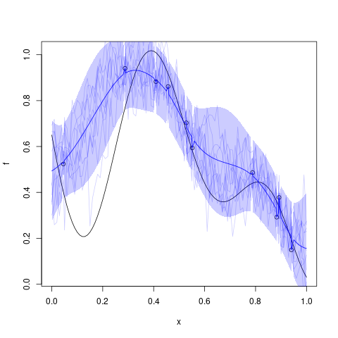

# `NuggetKriging`

## Description

Create an object `"NuggetKriging"` using
 the libKriging library.


## Usage

Just build the model:
```r
NuggetKriging(kernel)
# later, call fit(y,X,...)
```
or, build and fit at the same time:
```r
NuggetKriging(
  y,
  X,
  kernel,
  regmodel = "constant",
  normalize = FALSE,
  optim = "BFGS",
  objective = "LL",
  parameters = NULL
)
```


## Arguments

Argument      |Description
------------- |----------------
`y`     |     Numeric vector of response values.
`X`     |     Numeric matrix of input design.
`kernel`     |     Character defining the covariance model: `"gauss"` , `"exp"` , `"matern3_2"` , `"matern5_2"`.
`regmodel`     |     Universal NuggetKriging linear trend.
`normalize`     |     Logical. If `TRUE` both the input matrix `X` and the response `y` in normalized to take values in the interval $[0, 1]$ .
`optim`     |     Character giving the Optimization method used to fit hyper-parameters. Possible values are: `"BFGS"` and `"none"` , the later simply keeping the values given in `parameters` . The method `"BFGS"` uses the gradient of the objective.
`objective`     |     Character giving the objective function to optimize. Possible values are: `"LL"` for the Log-Likelihood and `"LMP"` for the Log-Marginal Posterior.
`parameters`     |     Initial values for the hyper-parameters. When provided this must be named list with some elements `"sigma2"`, `"theta"`, `"nugget"` containing the initial value(s) for the variance, range and nugget parameters. If `theta` is a matrix with more than one row, each row is used as a starting point for optimization.


## Details

The hyper-parameters (variance, nugget and vector of correlation ranges)
 are estimated thanks to the optimization of a criterion given by
 `objective` , using the method given in `optim` .


## Value

An object `"NuggetKriging"` . Should be used
 with its `predict` , `simulate` , `update` 
 methods.


## Examples

```r
f <- function(x) 1 - 1 / 2 * (sin(12 * x) / (1 + x) + 2 * cos(7 * x) * x^5 + 0.7)
set.seed(123)
X <- as.matrix(runif(10))
y <- f(X) + 0.1 * rnorm(nrow(X))
## fit and print
k <- NuggetKriging(y, X, kernel = "matern3_2")
k

x <- sort(c(X,as.matrix(seq(from = 0, to = 1, length.out = 101))))
p <- k$predict(x = x, stdev = TRUE, cov = FALSE)

plot(f)
points(X, y)
lines(x, p$mean, col = "blue")
polygon(c(x, rev(x)), c(p$mean - 2 * p$stdev, rev(p$mean + 2 * p$stdev)),
border = NA, col = rgb(0, 0, 1, 0.2))

s <- k$simulate(nsim = 10, seed = 123, x = x)

matlines(x, s, col = rgb(0, 0, 1, 0.2), type = "l", lty = 1)
```

### Results
```{literalinclude} ../functions/examples/NuggetKriging.md.Rout
:language: bash
```


