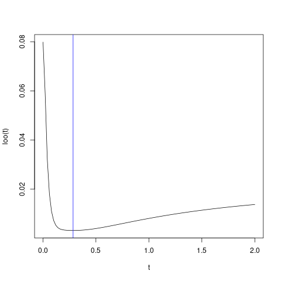

# `Kriging::leaveOneOutFun`

## Description

Compute the Leave-One-Out (LOO) Sum of Squares of Errors
 for a ` Kriging`  Object and a Vector $\boldsymbol{\theta}$
 of Correlation Ranges


## Usage

* Python
    ```python
    # k = Kriging(...)
    k.logMargPostFun(theta, grad = FALSE)
    ```
* R
    ```r
    # k = Kriging(...)
    k$logMargPostFun(theta, grad = FALSE)
    ```
* Matlab/Octave
    ```octave
    % k = Kriging(...)
    k.logMargPostFun(theta, grad = FALSE)
    ```


## Arguments

Argument      |Description
------------- |----------------
`theta`     |     A numeric vector of range parameters at which the LOO sum of squares will be evaluated.
`grad`     |     Logical. Should the gradient (w.r.t. `theta` ) be returned?


## Details

The Leave-One-Out (LOO) sum of squares is defined by
$\texttt{SS}_{\texttt{LOO}}(\boldsymbol{\theta}) := \sum_{i=1}^n
\{y_i - \widehat{y}_{i\vert -i}\}^2$ where $\widehat{y}_{i\vert -i}$
denotes the prediction of $y_i$ based on the observations $y_j$ with
$j \neq i$. The vector $\widehat{\mathbf{y}}_{\texttt{LOO}}$ of LOO
predictions is computed efficiently, see [here](SecLOO) for details.

## Value

The value $\texttt{SSE}_{\texttt{LOO}}(\boldsymbol{\theta})$ of the
Leave-One-Out Sum of Squares for the given vector
$\boldsymbol{\theta}$ of correlation ranges.


## Examples

```r
f <- function(x) 1 - 1 / 2 * (sin(12 * x) / (1 + x) + 2 * cos(7 * x) * x^5 + 0.7)
set.seed(123)
X <- as.matrix(runif(10))
y <- f(X)

k <- Kriging(y, X, kernel = "matern3_2", objective = "LOO", optim="BFGS")
print(k)

loo <-  function(theta) k$leaveOneOutFun(theta)$leaveOneOut
t <-  seq(from = 0.001, to = 2, length.out = 101)
plot(t, loo(t), type = "l")
abline(v = k$theta(), col = "blue")
```

### Results
```{literalinclude} ../functions/examples/leaveOneOutFun.Kriging.md.Rout
:language: bash
```



