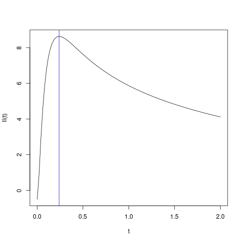

# `Kriging::logLikelihoodFun`


## Description

Compute Log-Likelihood of Kriging Model for given $\theta$


## Usage

* Python
    ```python
    # k = Kriging(...)
    k.logLikelihoodFun(theta)
    ```
* R
    ```r
    # k = Kriging(...)
    k$logLikelihoodFun(theta)
    ```
* Matlab/Octave
    ```octave
    % k = Kriging(...)
    k.logLikelihoodFun(theta)
    ```


## Arguments

Argument      |Description
------------- |----------------
`theta`     |     A numeric vector of (positive) range parameters at which the log-likelihood will be evaluated.
`grad`     |     Logical. Should the function return the gradient?
`hess`     |     Logical. Should the function return Hessian?


## Value

The log-Likelihood computed for given
  $\theta$ .


## Examples

```r
f <- function(x) 1 - 1 / 2 * (sin(12 * x) / (1 + x) + 2 * cos(7 * x) * x^5 + 0.7)
set.seed(123)
X <- as.matrix(runif(10))
y <- f(X)

k <- Kriging(y, X, kernel = "matern3_2")
print(k)

ll <- function(theta) k$logLikelihoodFun(theta)$logLikelihood

t <- seq(from = 0.001, to = 2, length.out = 101)
plot(t, ll(t), type = 'l')
abline(v = k$theta(), col = "blue")
```

### Results
```{literalinclude} ../functions/examples/logLikelihoodFun.Kriging.md.Rout
:language: bash
```

